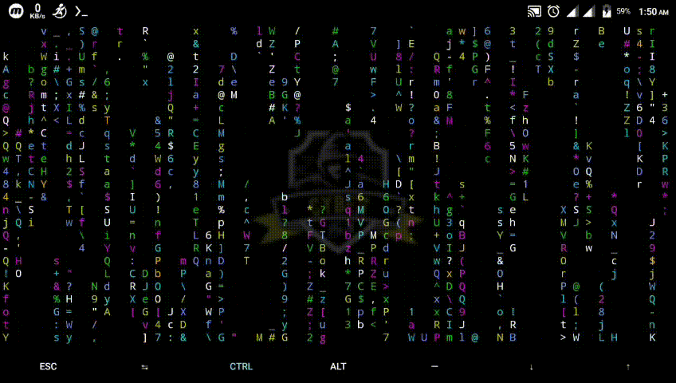

<!-- tmklCommands -->

<p align="center">
  
</p>

<p align="center">Termux and Kali Linux all Commands.</p>

##

### Termux all Commands

```
$ pkg update
$ pkg upgrade
$ apt update && apt upgrade
$ pkg install python
$ pkg install python2
$ pkg install python3
$ pkg install git
$ pkg install php
$ pkg install wget
$ pkg install nano
$ apt install figlet
$ pkg install python3 python3-pip git -y
$ termux-setup-storage
```

- `cmatrix` Hacker intro
```
$ apt install cmatrix
$ cmatrix
```
- Any tool `Uninstall`
```
$ rm -rf (uninstall tools name)
```
- File and folder transfer from SD Card to termux
```
$ cd /sdcard
$ ls
$ cp -r (file or folder name) /$HOME
$ cd
$ ls
```

##

### Kali Linux all Commands
